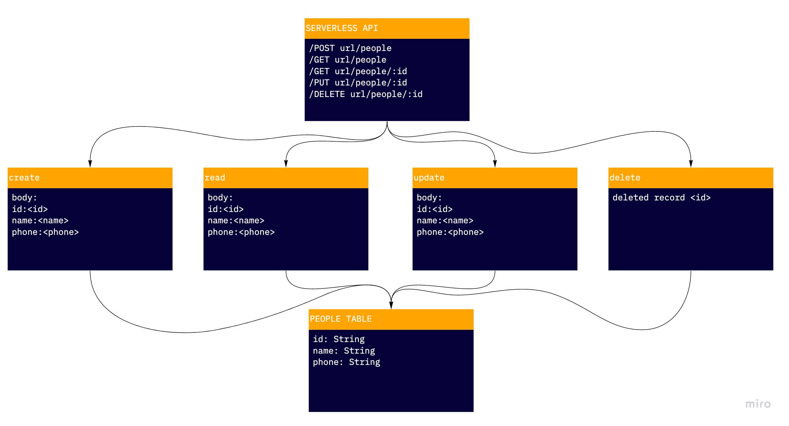

# Serverless API

Deployed API: [https://7sdv4djzvg.execute-api.us-west-2.amazonaws.com/people](https://7sdv4djzvg.execute-api.us-west-2.amazonaws.com/people)

Pull Request: [https://github.com/peterjast/serverless-api/pull/1](https://github.com/peterjast/serverless-api/pull/1)

## Routes

/POST

/GET - get all or include an id parameter to get one

/PUT - requires an id parameter and a body including name and phone

/DELETE - requires id parameter

## UML

